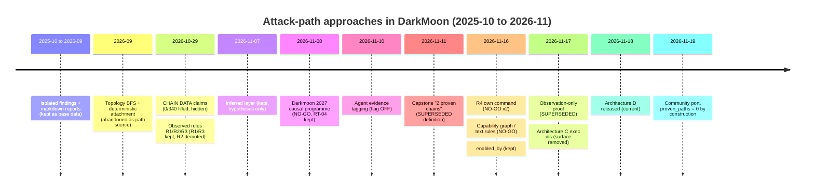

# 07 — Approach history

```mermaid
timeline
  title Attack-path approaches in DarkMoon (2025-10 to 2026-11)
  2025-10 to 2026-09 : Isolated findings + markdown reports (kept as base data)
  2026-09 : Topology BFS + deterministic attachment (abandoned as path source)
  2026-10-29 : CHAIN DATA claims (0/340 filled, hidden) : Observed rules R1/R2/R3 (R1/R3 kept, R2 demoted)
  2026-11-07 : Inferred layer (kept, hypotheses only)
  2026-11-08 : Darkmoon 2027 causal programme (NO-GO, RT-04 kept)
  2026-11-10 : Agent evidence tagging (flag OFF)
  2026-11-11 : Capstone "2 proven chains" (SUPERSEDED definition)
  2026-11-16 : R4 own command (NO-GO x2) : Capability graph / text rules (NO-GO) : enabled_by (kept)
  2026-11-17 : Observation-only proof (SUPERSEDED) : Architecture C exec ids (surface removed)
  2026-11-18 : Architecture D released (current)
  2026-11-19 : Community port, proven_paths = 0 by construction
```

Details and sources: [`../docs/architecture/README.md`](../docs/architecture/README.md) §2 and §4; decisions: [`../decisions/`](../decisions/README.md).
